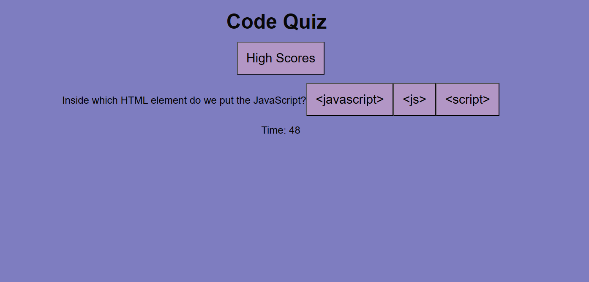

# Code-Quiz
In future interviews there is a general possibility of being asked to complete a coding assessment involving multiple choice and coding challenges. In order to prepare for this I have built a timed coding quiz with multiple-choice questions, featuring Javascript, CSS and HTML that I have created from scratch. 

The outline of the project is that I am presented with that quiz that allows me to choose from the multiple choice answers. If I am to answer a question incorrectly the time remaining will be penalised. When you game is over I can then save my initials and score to a leader board allowing me to track my progress.

## Screenshots

## Link to Deployed Application

https://shs-peb.github.io/Code-Quiz/
